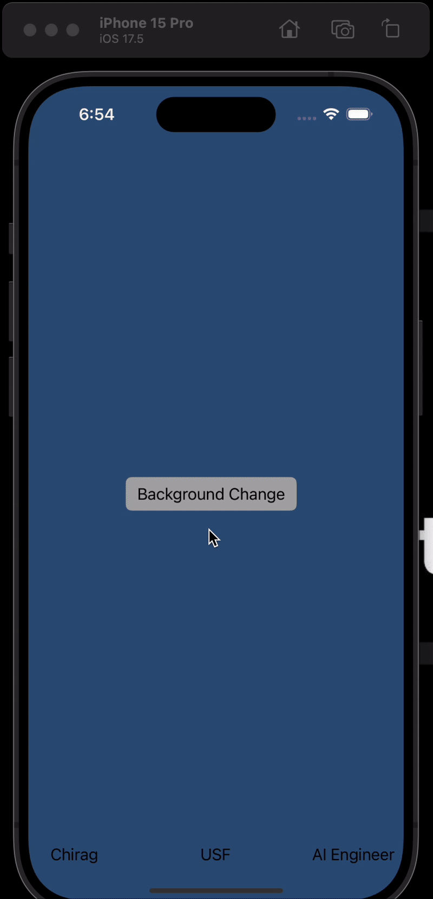

# iOS101

# Prework - App-into-Codepath

Submitted by: **Chirag Singh**

**App-into-Codepath** is an app that allows users to interact with a simple interface containing three labels and a button. When the button is tapped, the app dynamically changes the background color to a randomly generated one, showcasing basic iOS development concepts like UI design, logic implementation, and Swift programming.

Time spent: **3** hours spent in total

## Required Features

The following **required** functionality is completed:

- [Yes] Users are see a screen with three labels and a button
- [Yes] Tapping the button changes the screen color to a random color
 
## Video Walkthrough

## App Brainstorming (Step 4)
1. **Instagram**
   - Customizable themes for chats.
   - Simple and intuitive user interface.
   - Explore page personalized based on user interests.

2. **Spotify**
   - Ability to create and share playlists.
   - Personalized recommendations through the Discover Weekly feature.
   - Offline playback for downloaded music.
 **Google Maps**
   - Real-time traffic updates and alternate routes.
   - Offline maps for navigation without an internet connection.
   - Detailed search for nearby amenities like restaurants and gas stations.
  
I would like to build an app called **Moodify**. This app would generate playlists based on a user’s current mood using AI sentiment analysis. Users could input their mood via text or voice, and the app would create a customized playlist by analyzing keywords or tone. Additional features could include mood tracking over time, integration with Spotify for playback, and an option to share moods and playlists with friends. This app would focus on creating a unique music experience tailored to individual emotions.

## Notes
Challenges encountered while building the app:
- Understanding the Xcode interface and its different components for the first time.
- Linking UI elements to the logic using `IBActions`.
- Debugging minor syntax errors while writing Swift code for the first time.

## License

    Copyright [2025] [Chirag]

    Licensed under the Apache License, Version 2.0 (the "License");
    you may not use this file except in compliance with the License.
    You may obtain a copy of the License at

        http://www.apache.org/licenses/LICENSE-2.0

    Unless required by applicable law or agreed to in writing, software
    distributed under the License is distributed on an "AS IS" BASIS,
    WITHOUT WARRANTIES OR CONDITIONS OF ANY KIND, either express or implied.
    See the License for the specific language governing permissions and
    limitations under the License.
